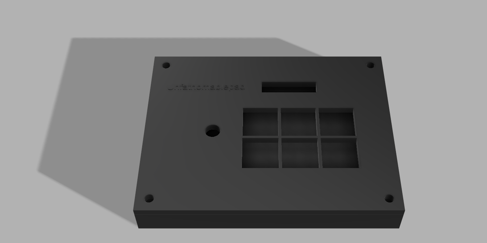
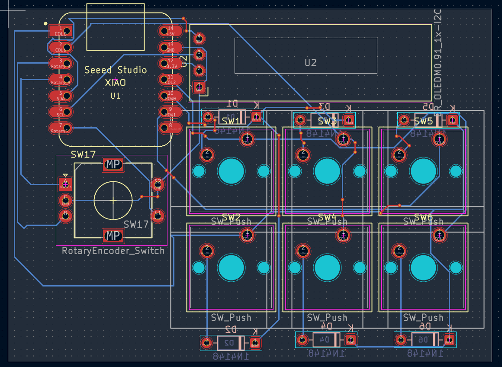
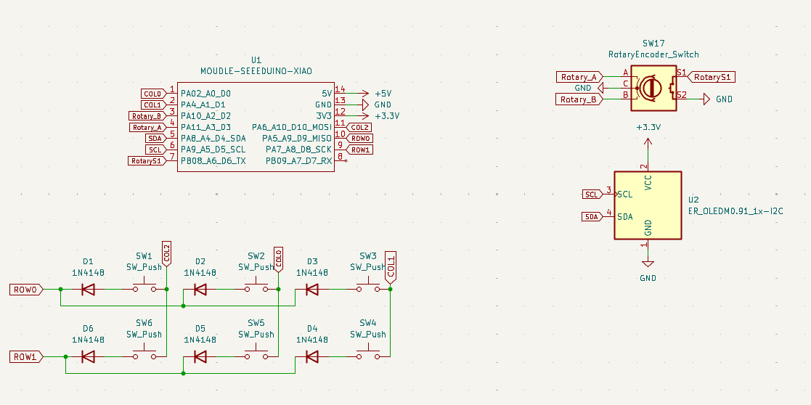

# Unfathomablepad

Unfathomably bad design pcb

### Macropad Render & Case

### PCB Layout

### Schematic

---

## Bill of Materials

| Qty | Component
| :---: | :--- |
| **1x** | Seeeduino XIAO | 
| **6x** | Diodes | 1N4148 |
| **6x** | Mechanical Switches | 
| **1x** | Rotary Encoder
| **1x** | OLED Display
| **1x** | 3D-Printed Case PA 12 Nylon (PA 603-CF) ||